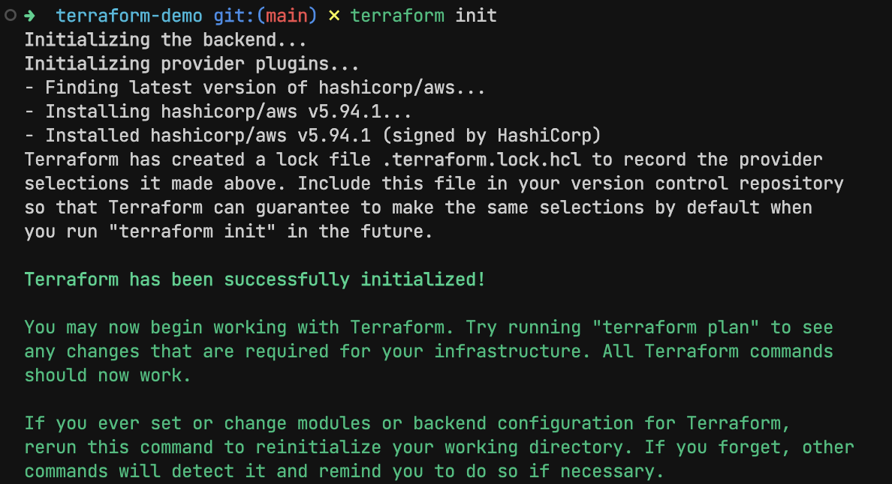
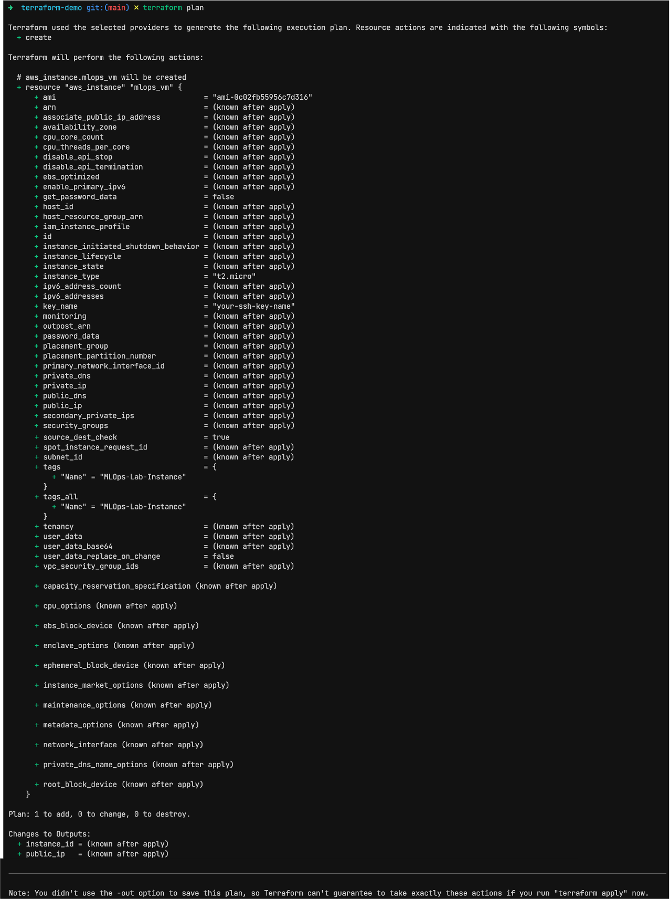

# Experiment 1

## Aim

In modern DevOps and MLOps practices, managing infrastructure through code — known as Infrastructure as Code (IaC) — is essential for consistency, scalability, and automation. One of the most widely adopted tools for this purpose is Terraform, an open-source IaC tool developed by HashiCorp.

Terraform allows users to define and provision cloud infrastructure using a declarative configuration language called HCL (HashiCorp Configuration Language). Instead of manually clicking through a cloud console, infrastructure is defined in .tf files that can be version-controlled and reused across environments.

## Core Concepts

Providers: These are plugins that allow Terraform to interact with cloud platforms (e.g., AWS, Azure, GCP). Each provider exposes resources and data sources.

Resources: The actual infrastructure elements you want to create, such as EC2 instances, S3 buckets, or Azure VMs.

Variables: Used for dynamic configuration. Helps avoid hardcoding values and enables reusability.

State Management: Terraform keeps track of what infrastructure it manages via a state file. This file is crucial for determining changes and performing updates.

Plan, Apply, Destroy: The main Terraform workflow involves terraform plan, terraform apply, and optionally terraform destroy, allowing safe preview and execution of infrastructure changes.

## Experiment

### Code

_main.tf_

```tf
provider "aws" {
  region = var.aws_region
}

resource "aws_instance" "mlops_vm" {
  ami           = var.ami_id
  instance_type = var.instance_type
  key_name      = var.key_name

  tags = {
    Name = "MLOps-Lab-Instance"
  }
}
```

_terraform.tfvars_

```tf
ami_id        = "ami-0c02fb55956c7d316" # Amazon Linux 2 AMI
key_name      = "your-ssh-key-name"
```

_variables.tf_

```tf
variable "aws_region" {
  type    = string
  default = "us-east-1"
}

variable "ami_id" {
  description = "AMI ID for the EC2 instance"
  type        = string
}

variable "instance_type" {
  default = "t2.micro"
  type    = string
}

variable "key_name" {
  description = "SSH key name in AWS"
  type        = string
}
```

_outputs.tf_

```outputs.tf
output "instance_id" {
  value = aws_instance.mlops_vm.id
}

output "public_ip" {
  value = aws_instance.mlops_vm.public_ip
}
```

### Commands

```sh
terraform init
terraform plan
terraform apply
```

## Outputs



_terraform init_



_terraform plan_

## Conclusion

This lab demonstrated the power and simplicity of using Terraform for infrastructure provisioning. Instead of manually clicking through AWS's UI, the infrastructure was defined as code — making it reproducible, auditable, and scalable.

We explored essential components like providers, variables, and Terraform state, which are critical for real-world DevOps and MLOps automation workflows. Understanding and applying these principles lays the groundwork for managing complex ML systems across environments with reliability and control.
