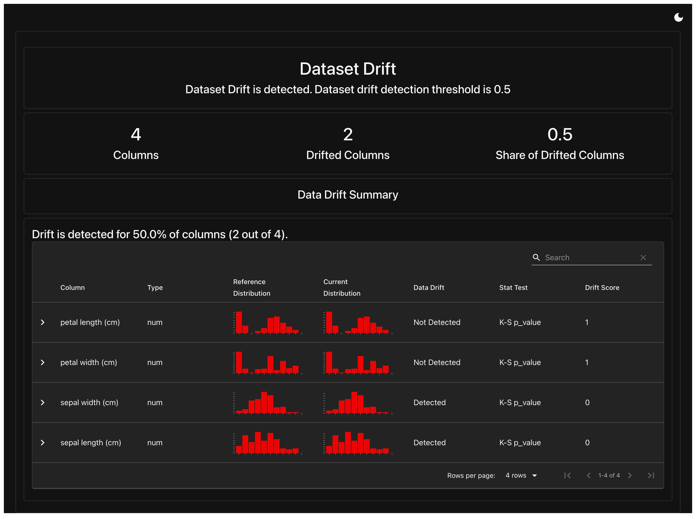

# Experiment 10

## Aim

Model Drift Detection: Use tools like Evidently or custom scripts to monitor and detect data/model drift over time.

## Theory

In the real world, machine learning models are not "train once, run forever." They depend heavily on the data distribution they were trained on. Over time, changes in data patterns can degrade model performance—a phenomenon known as model drift or data drift.

Data Drift: The statistical distribution of input data changes over time, even if the output (label) remains the same.
Example: A spam detection model starts receiving emails with different vocabulary or structure compared to training data.

Concept Drift: The relationship between inputs and outputs changes over time.
Example: Customer behavior shifts due to market changes—features that once predicted churn may no longer work.

If drift goes unnoticed:

- Model predictions can become inaccurate or even harmful.
- Business decisions based on the model become unreliable.
- Trust in AI/ML systems erodes.

Monitoring drift is essential for ML model reliability and accountability.

## Experiment

```python
import pandas as pd
from sklearn.datasets import load_iris
from evidently import Report
from evidently.presets import DataDriftPreset
import matplotlib.pyplot as plt


# Load base dataset
iris = load_iris()
df_ref = pd.DataFrame(iris.data, columns=iris.feature_names)

# Simulate drift by changing feature distributions
df_drift = df_ref.copy()
df_drift["sepal length (cm)"] += 1.5  # Simulate shift
df_drift["sepal width (cm)"] *= 1.2  # Simulate scale change

# Create Evidently report
report = Report(metrics=[DataDriftPreset()])
eval = report.run(reference_data=df_ref, current_data=df_drift)

# Save as HTML report
eval.save_html("iris_drift_report.html")
print("Drift report saved as iris_drift_report.html")
```

## Output



## Conclusion

In this lab, we explored model drift detection using Evidently, a powerful tool for ML monitoring. We simulated data drift by altering distributions in a well-known dataset, and generated a visual, data-driven report to highlight the impact.

Detecting drift is not just a technical best practice—it’s a critical component of maintaining trustworthy and effective machine learning systems. With regular monitoring in place, teams can proactively retrain or recalibrate models, ensuring sustained performance even as the world around them changes.
