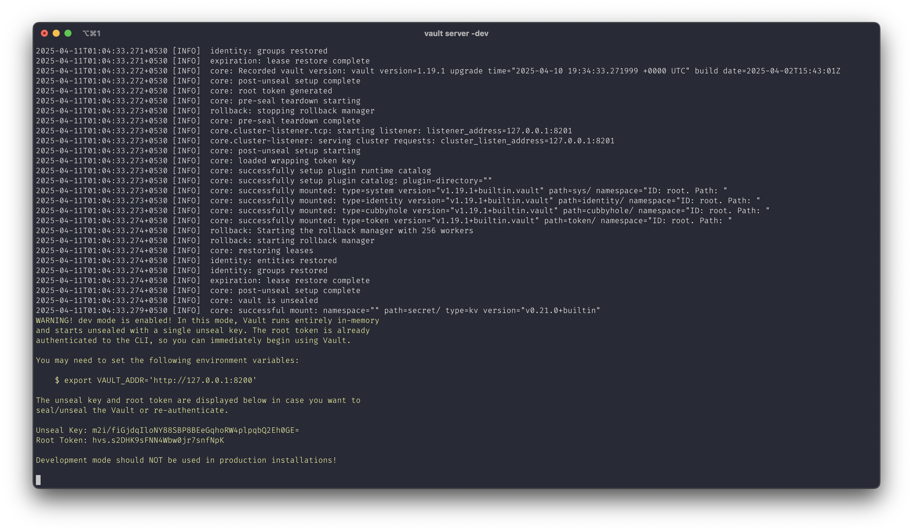
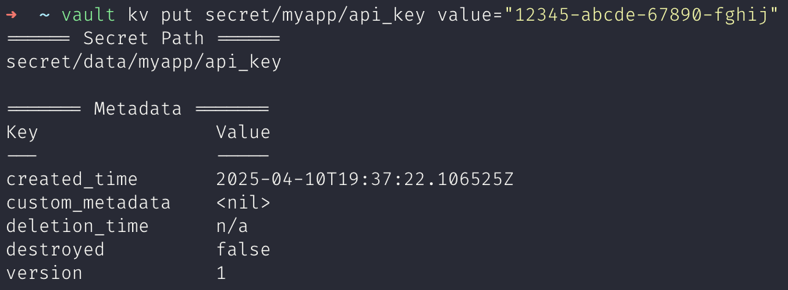
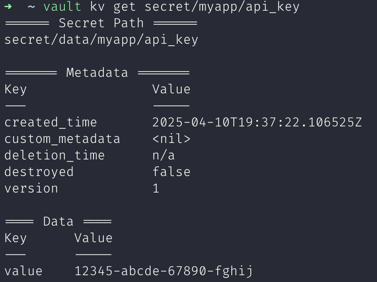
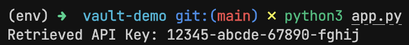

# Experiment 2

## Aim

Secrets Management with HashiCorp Vault: Securely store and access secrets like API keys and credentials using Vault and integrate it into your deployment pipeline.

## Theory

Secrets management refers to the process of securely storing, accessing, and controlling the distribution of sensitive data (e.g., passwords, API keys, certificates). It's a crucial aspect of maintaining security and ensuring that only authorized users or systems have access to this data. Secrets management is especially important in modern application deployments, where automated CI/CD pipelines, containerization, and cloud services are commonplace.

With the rise of microservices, distributed systems, and DevOps practices, traditional methods of managing secrets (e.g., hardcoding credentials in code or using environment variables) are no longer secure or scalable. In response, solutions like HashiCorp Vault have emerged to provide a centralized, secure way to manage secrets.

HashiCorp Vault is a powerful, open-source tool for managing secrets and sensitive data. It provides:

- Centralized secrets management: Store API keys, database credentials, SSH keys, etc.
- Dynamic secrets: Generate secrets dynamically, such as AWS credentials or database passwords, with a set TTL (Time-to-Live).
- Access control: Fine-grained access control using policies, ensuring only authorized users or applications can access specific secrets.
- Audit logs: Track access to secrets with detailed logs for compliance.
- Vault integrates seamlessly into DevOps pipelines, enabling secure storage and retrieval of secrets during build, test, and deployment processes.

## Experiment

### Start vault server

```sh
vault server -dev
```

### Setup CLI

```sh
export VAULT_ADDR='http://127.0.0.1:8200'
export VAULT_TOKEN='hvs.s2DHK9sFNN4Wbw0jr7snfNpK'
```

### Set/Get Secret

```sh
vault kv put secret/myapp/api_key value="12345-abcde-67890-fghij"
```

```sh
vault kv get secret/myapp/api_key
```

### Access from application

```python
import os
from hvac import Client
from dotenv import load_dotenv

load_dotenv()

# Initialize the Vault client
vault_client = Client(url=os.getenv("VAULT_ADDR"), token=os.getenv("VAULT_TOKEN"))

# Fetch the secret from Vault
secret = vault_client.secrets.kv.v2.read_secret(path="/myapp/api_key")

# Extract the API key from the response
api_key = secret["data"]["data"]["value"]

# Use the API key in the application (for demonstration purposes, we'll print it)
print(f"Retrieved API Key: {api_key}")
```

## Outputs



_Starting vault server_



_Setting secret_



_Getting secret_



_Accessing secret from application_

## Conclusion

HashiCorp Vault provides a secure, scalable, and highly flexible solution for managing secrets and sensitive data. In this lab, we demonstrated how to:

- Store secrets like API keys securely in Vault.
- Integrate Vault into a deployment pipeline, ensuring secrets are accessed dynamically and securely during runtime.
- Use Vault's secrets management features, such as fine-grained access control, audit logging, and the ability to store dynamic secrets.
