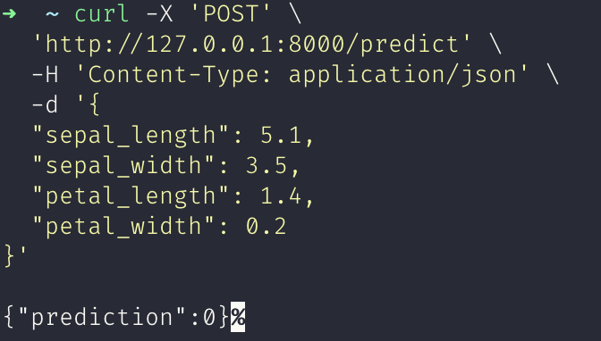

# Experiment 3

## Aim

Model Serving with FastAPI — Deploy a trained ML model using FastAPI to expose endpoints like /predict and test with real input data.

## Theory

Model serving refers to the process of deploying a machine learning model into a production environment where it can receive real-time input data, process it, and return predictions or other results. After training a model, the next step is to make it accessible for use in applications, APIs, or other services.

To achieve this, you need to create a RESTful API that can accept input, pass the data to the trained model, and then return the prediction. Model serving frameworks like FastAPI are highly suited for this task because they provide easy, fast, and scalable ways to build APIs.

FastAPI is a modern, fast (high-performance), web framework for building APIs with Python. It’s built on top of Starlette for the web parts and Pydantic for data validation. What makes FastAPI particularly attractive for model serving is its:

- High performance: Due to its asynchronous capabilities and reliance on Python type hints, FastAPI is one of the fastest frameworks available for building APIs.
- Easy integration: FastAPI integrates easily with machine learning frameworks (e.g., TensorFlow, PyTorch, Scikit-Learn) and tools (e.g., Docker) for deploying models.
- Automatic validation: FastAPI automatically validates incoming data using Pydantic models, which ensures that the data adheres to the expected format and type.

## Experiment

```python
from fastapi import FastAPI
from pydantic import BaseModel
import joblib
import numpy as np

# Load the trained model
model = joblib.load("model.pkl")

# Define FastAPI app
app = FastAPI()

# Define a Pydantic model for input validation
class PredictionInput(BaseModel):
    sepal_length: float
    sepal_width: float
    petal_length: float
    petal_width: float

# Define a prediction endpoint
@app.post("/predict")
def predict(input_data: PredictionInput):
    # Convert the input data to a numpy array (model expects numpy arrays)
    input_features = np.array([[input_data.sepal_length,
                                input_data.sepal_width,
                                input_data.petal_length,
                                input_data.petal_width]])

    # Get the model's prediction
    prediction = model.predict(input_features)

    # Return the prediction result
    return {"prediction": int(prediction[0])}
```

## Output



_Testing /predict endpoint_

## Conclusion

In this lab, we demonstrated how to deploy a machine learning model using FastAPI. We walked through the following steps:

- Built a FastAPI app that exposes a /predict endpoint to make predictions using the trained model.
- Tested the deployment by sending a POST request to the FastAPI server and receiving predictions.
