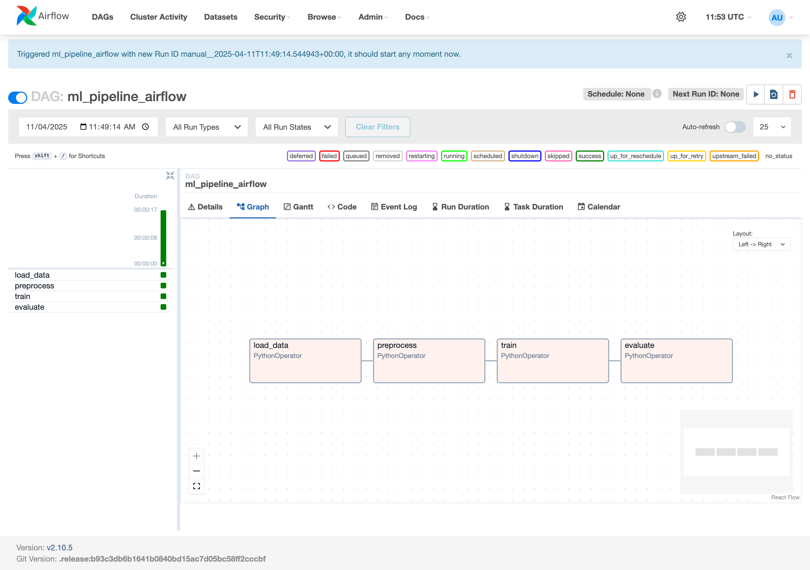

# Experiment 4

## Aim

Automated ML Pipelines with Apache Airflow: Build a Directed Acyclic Graph (DAG) in Airflow to automate tasks such as data loading, preprocessing, training, and evaluation.

## Theory

Machine learning projects often involve repetitive tasks—loading data, preprocessing, model training, evaluation, and storing results. Manually executing each of these steps introduces risks: inconsistencies, human errors, and inefficiency. This is where workflow orchestration tools come in.

Apache Airflow is an open-source platform to programmatically author, schedule, and monitor workflows. It uses DAGs (Directed Acyclic Graphs) to represent workflows. Each DAG consists of a set of tasks, and each task performs a discrete piece of work. These tasks are connected based on dependencies.

For ML workflows, Airflow is a game-changer. It allows:

- Modular, reusable task definitions
- Scheduled or event-triggered runs
- Monitoring and logging
- Integration with ML tools, cloud providers, and databases

Airflow also supports task retries, alerting, and dynamic pipelines—ideal for real-world ML systems.

## Experiment

### Setup Airflow

```sh
python -m venv airflow-venv
source airflow-venv/bin/activate
pip install apache-airflow

# Initialize Airflow
airflow db init

# Create a user
airflow users create \
  --username admin \
  --password admin \
  --firstname Admin \
  --lastname User \
  --role Admin \
  --email admin@example.com

# Start Airflow webserver and scheduler
airflow webserver -p 8080  # In one terminal
airflow scheduler          # In another terminal
```

### Create Pipeline

_steps.py_

```python
import pandas as pd
from sklearn.datasets import load_iris
from sklearn.ensemble import RandomForestClassifier
from sklearn.model_selection import train_test_split
from sklearn.metrics import accuracy_score
import joblib

def save_iris_data():
    iris = load_iris()
    df = pd.DataFrame(iris.data, columns=iris.feature_names)
    df['target'] = iris.target
    df.to_csv('data/iris.csv', index=False)

def preprocess_data():
    df = pd.read_csv('data/iris.csv')
    X = df.drop('target', axis=1)
    y = df['target']
    X_train, X_test, y_train, y_test = train_test_split(X, y, test_size=0.2, random_state=42)
    X_train.to_csv('data/X_train.csv', index=False)
    X_test.to_csv('data/X_test.csv', index=False)
    y_train.to_csv('data/y_train.csv', index=False)
    y_test.to_csv('data/y_test.csv', index=False)

def train_model():
    X_train = pd.read_csv('data/X_train.csv')
    y_train = pd.read_csv('data/y_train.csv').values.ravel()
    model = RandomForestClassifier(n_estimators=100)
    model.fit(X_train, y_train)
    joblib.dump(model, 'data/model.pkl')

def evaluate_model():
    X_test = pd.read_csv('data/X_test.csv')
    y_test = pd.read_csv('data/y_test.csv').values.ravel()
    model = joblib.load('data/model.pkl')
    preds = model.predict(X_test)
    acc = accuracy_score(y_test, preds)
    with open("data/accuracy.txt", "w") as f:
        f.write(f"Accuracy: {acc}")
```

_pipeline.py_

```python
from airflow import DAG
from airflow.operators.python import PythonOperator
from datetime import datetime
import steps

default_args = {
    'owner': 'airflow',
    'start_date': datetime(2024, 1, 1),
    'retries': 1,
}

with DAG(
    dag_id='ml_pipeline_airflow',
    default_args=default_args,
    schedule_interval=None,
    catchup=False,
    tags=["mlops", "demo"]
) as dag:

    load_data = PythonOperator(
        task_id='load_data',
        python_callable=steps.save_iris_data,
    )

    preprocess = PythonOperator(
        task_id='preprocess',
        python_callable=steps.preprocess_data,
    )

    train = PythonOperator(
        task_id='train',
        python_callable=steps.train_model,
    )

    evaluate = PythonOperator(
        task_id='evaluate',
        python_callable=steps.evaluate_model,
    )

    load_data >> preprocess >> train >> evaluate
```

### Copy Pipeline

```sh
mkdir -p ~/airflow/dags
cp steps.py ~/airflow/dags/
cp pipeline.py ~/airflow/dags/
```

## Output



## Conclusion

This experiment demonstrates the power of Apache Airflow in orchestrating ML pipelines. By modularizing tasks like data loading, preprocessing, training, and evaluation, we gained:

- Reusability: Each task is reusable and independently manageable.
- Traceability: Logs and execution states are easily monitored.
- Scalability: Future tasks (e.g., model registration, deployment) can be seamlessly added.
- Automation: Pipelines can run on a schedule or based on events, eliminating manual triggers.

For ML teams, especially in production environments, using a tool like Airflow ensures that workflows are reliable, reproducible, and maintainable. It brings engineering discipline to data science.
