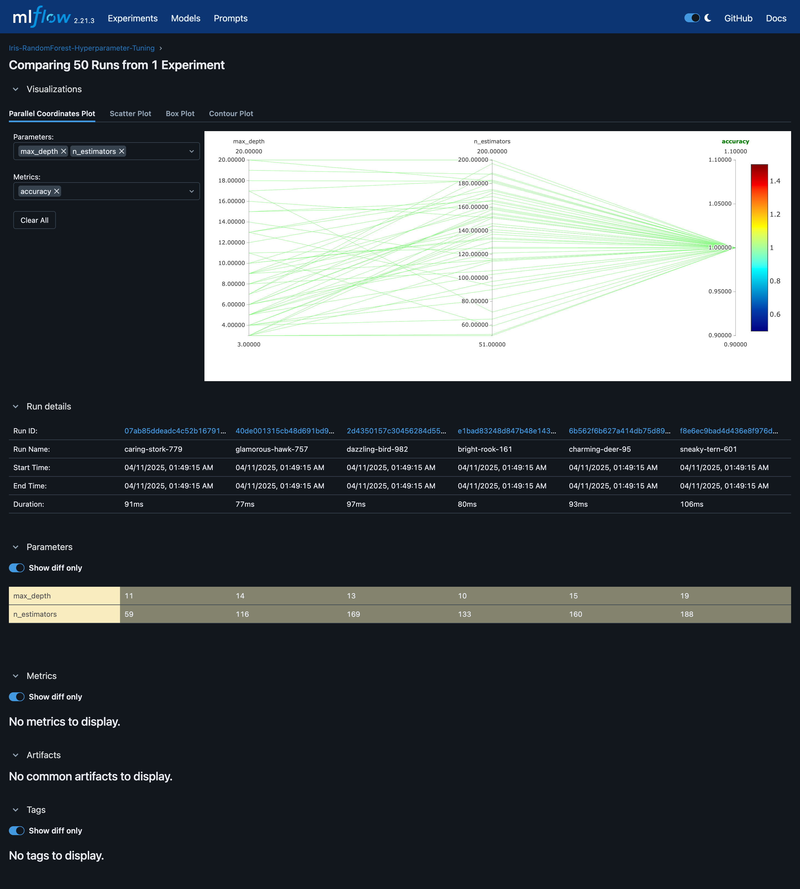

# Experiment 5

## Aim

Hyperparameter Tuning with Optuna – Implement Optuna for automated hyperparameter optimization and integrate it with MLflow for experiment logging.

## Theory

Hyperparameter tuning is the process of finding the best combination of hyperparameters (such as learning rate, batch size, number of layers, etc.) for a machine learning model. The goal is to improve model performance by identifying optimal values for these hyperparameters.

Hyperparameters are parameters that are not learned from the data but are set before training, such as the learning rate in a neural network or the number of trees in a random forest. Selecting the right values for these hyperparameters can significantly affect a model’s accuracy, speed, and overall performance.

Optuna is an open-source hyperparameter optimization framework designed to automate the process of finding optimal hyperparameters for machine learning models. It supports different optimization algorithms, including random search, grid search, and a more sophisticated approach called Tree-structured Parzen Estimators (TPE), which helps find better results in fewer trials.

Optuna is particularly efficient for optimizing complex models or models that require expensive computational resources to train, such as deep neural networks.

MLflow is an open-source platform designed to manage the entire machine learning lifecycle, including experimentation, reproducibility, and deployment. It provides tools for:

- Tracking experiments: Log parameters, metrics, and outputs of model training.
- Managing models: Store and serve models.
- Reproducibility: Ensures that experiments can be reproduced and results can be traced.

When combined with Optuna, MLflow can log the hyperparameter configurations and the results of each optimization trial, making it easier to track the effectiveness of different configurations.

## Experiment

### Setup MLflow

```sh
pip install mlflow
mlflow ui
```

### ML Experiment

```python
from sklearn.datasets import load_iris
import pandas as pd
from sklearn.model_selection import train_test_split

import optuna
import mlflow
import mlflow.sklearn
from sklearn.ensemble import RandomForestClassifier
from sklearn.metrics import accuracy_score

# Load the Iris dataset
iris = load_iris()
X = pd.DataFrame(iris.data, columns=iris.feature_names)
y = iris.target

# Split data into training and test sets
X_train, X_test, y_train, y_test = train_test_split(X, y, test_size=0.2, random_state=42)

# Define the objective function for hyperparameter optimization
def objective(trial):
    # Start a new MLflow run for each trial
    with mlflow.start_run():
        # Hyperparameter search space
        n_estimators = trial.suggest_int("n_estimators", 50, 200)  # Number of trees
        max_depth = trial.suggest_int("max_depth", 3, 20)  # Maximum depth of trees

        # Initialize the RandomForest model with selected hyperparameters
        model = RandomForestClassifier(n_estimators=n_estimators, max_depth=max_depth)

        # Train the model
        model.fit(X_train, y_train)

        # Predict and calculate accuracy
        y_pred = model.predict(X_test)
        accuracy = accuracy_score(y_test, y_pred)

        # Log the hyperparameters and the accuracy with MLflow
        mlflow.log_param("n_estimators", n_estimators)
        mlflow.log_param("max_depth", max_depth)
        mlflow.log_metric("accuracy", accuracy)

        return accuracy

if __name__ == "__main__":
    # Start MLflow experiment
    mlflow.set_tracking_uri(uri="http://127.0.0.1:5000/")
    mlflow.set_experiment("Iris-RandomForest-Hyperparameter-Tuning")  # Set an experiment name if necessary

    # Create an Optuna study to optimize the objective function
    study = optuna.create_study(direction="maximize")  # We want to maximize accuracy
    study.optimize(objective, n_trials=50)  # Run 50 trials

    # Best trial information
    print(f"Best Trial: {study.best_trial.params}")
    print(f"Best Accuracy: {study.best_value}")

```

## Outputs



_Hyperparameter tuning visualization in Mlflow_

## Conclusion

In this experiment, we demonstrated how to:

- Use Optuna to automate the hyperparameter optimization process for a machine learning model.
- Integrate Optuna with MLflow to track experiments, including hyperparameter values and performance metrics, ensuring reproducibility and ease of comparison between different trials.
- Leverage the power of automated hyperparameter search to find the best configuration for a Random Forest classifier using the Iris dataset.

By combining Optuna and MLflow, we gain significant benefits in terms of both optimization and experiment tracking. Optuna helps automate the search for optimal hyperparameters, making the process faster and more efficient. Meanwhile, MLflow provides a centralized platform for managing and tracking experiments, which is invaluable when working on more complex ML projects.
