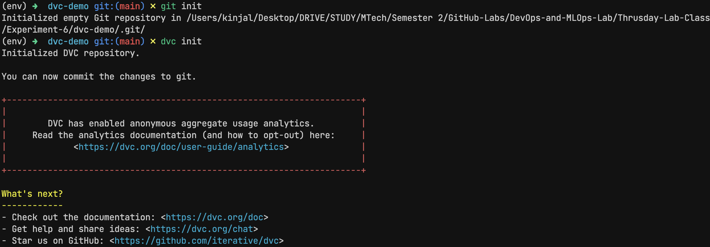
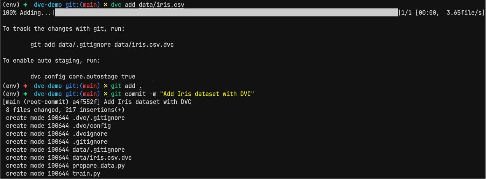
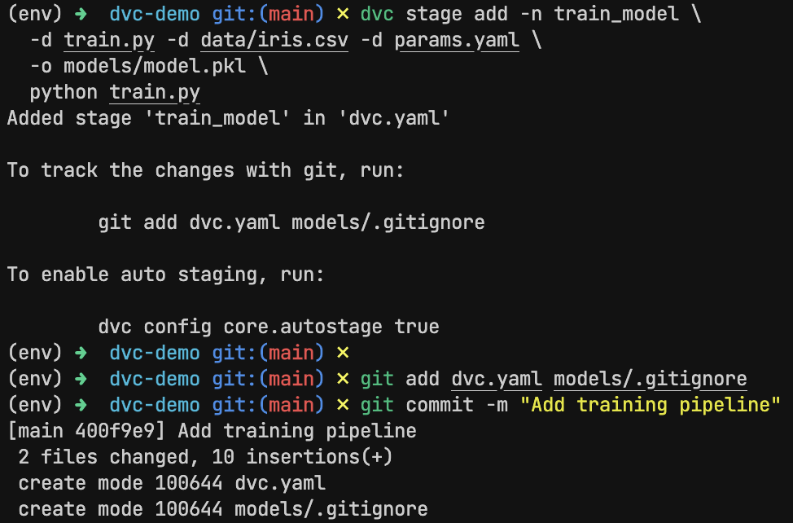
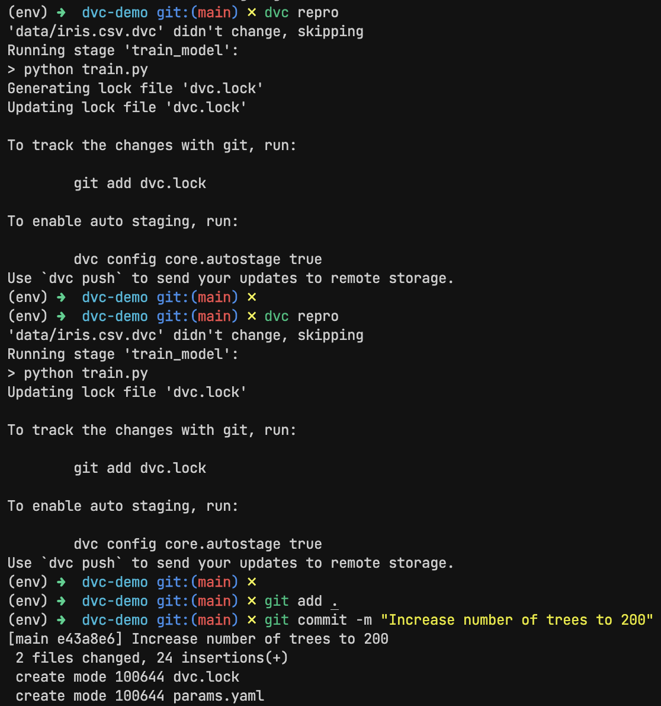

# Experiment 6

## Aim

Data Versioning with DVC: Use DVC to track versions of datasets and models, and connect it with Git for full ML lifecycle version control.

## Theory

DVC (Data Version Control) is an open-source tool designed to bring the benefits of version control (like Git) to data science and machine learning workflows. While Git is great for tracking code, it isn’t optimized for large files like datasets, model binaries, or artifacts. This is where DVC steps in.

With DVC, you can:

- Track large files like datasets and models.
- Reproduce entire ML pipelines.
- Collaborate easily across teams.
- Integrate with Git for full lifecycle control (code + data + experiments).

It uses .dvc files and a remote storage system (like a local folder, S3, GCS, etc.) to manage actual data, while keeping metadata in Git.

In a typical ML project, data evolves just as much as code. You might start with a sample dataset, then receive an updated one, or clean your data differently across iterations. Similarly, model files change based on training data, hyperparameters, or model architecture. If you can’t track and reproduce these changes, you're left with guesswork when bugs or inconsistencies arise.

That’s why DVC is crucial: it helps ensure that your code, data, and models are always in sync—and reproducible.

## Experiment

### Initialize DVC

```sh
git init
dvc init
```

### Adding dataset to DVC

```sh
dvc add data/iris.csv
git add data.dvc .gitignore
git commit -m "Add Iris dataset with DVC"
```

### DVC Pipeline

```sh
dvc stage add -n train_model \
  -d train.py -d data/iris.csv -d params.yaml \
  -o models/model.pkl \
  python train.py

git add dvc.yaml dvc.lock train.py params.yaml
git commit -m "Add training pipeline"
```

### Running DVC Pipeline by changing hyperparameters

```sh
dvc repro

# change hyperparmeters in params.yaml

dvc repro
git add .
git commit -m "Increase number of trees to 200"
```

## Outputs



_Initialize DVC_



_Adding dataset to DVC_



_DVC Pipeline_



_Running DVC Pipeline by changing hyperparameters_

## Conclusion

In this experiment, we explored how DVC integrates with Git to provide full lifecycle management of ML projects. By versioning the dataset and model artifacts, and defining reproducible pipelines, DVC makes your ML workflow:

- Reproducible: Any experiment can be reproduced exactly.
- Trackable: Data and model changes are logged alongside code.
- Collaborative: Team members can pull the latest data and run the pipeline with confidence.
- Maintainable: Pipelines are modular, auditable, and easy to extend.

As machine learning systems grow more complex, tools like DVC become essential for teams to stay productive, agile, and aligned.
