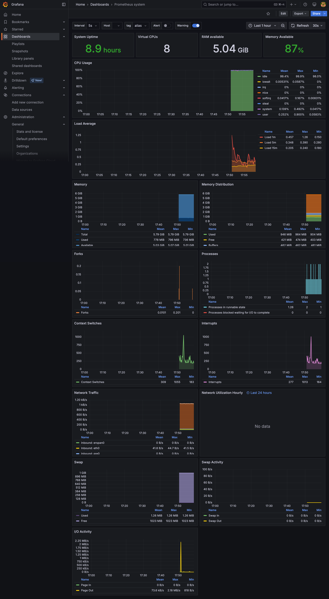

# Experiment 7

## Aim

Basic Monitoring with Prometheus and Grafana: Set up Prometheus to monitor system resources and visualize the metrics using Grafana dashboards.

## Theory

In both DevOps and MLOps, observability plays a crucial role in ensuring system reliability, performance, and transparency. As systems become increasingly complex—spanning microservices, containers, and ML pipelines—monitoring becomes the foundation for proactive debugging, incident response, and performance tuning.

Prometheus is an open-source monitoring system built for reliability and scalability. Originally developed at SoundCloud, it is now a part of the Cloud Native Computing Foundation (CNCF). Prometheus excels at time-series data collection, meaning it scrapes and stores metrics over time, allowing us to observe trends, set alerts, and investigate issues.

Key features:

- Pull-based model via HTTP (scrapes targets)
- Powerful PromQL (Prometheus Query Language)
- Lightweight and simple to deploy
- Supports exporters for different services (node, Docker, Kubernetes, etc.)

Grafana is a popular open-source visualization tool that connects to Prometheus (and other data sources) to provide beautiful and customizable dashboards. It brings data to life, making it easier to detect patterns and understand performance metrics at a glance.

Prometheus and Grafana together form a robust observability stack.

## Experiment

_prometheus.yml_

```yaml
# monitoring-stack/prometheus/prometheus.yml
global:
  scrape_interval: 15s

scrape_configs:
  - job_name: "prometheus"
    static_configs:
      - targets: ["localhost:9090"]

  - job_name: "node_exporter"
    static_configs:
      - targets: ["node_exporter:9100"]
```

_docker-compose.yaml_

```yaml
# monitoring-stack/docker-compose.yml
version: "3.8"

services:
  prometheus:
    image: prom/prometheus
    container_name: prometheus
    volumes:
      - ./prometheus/prometheus.yml:/etc/prometheus/prometheus.yml
    ports:
      - "9090:9090"

  node_exporter:
    image: prom/node-exporter
    container_name: node_exporter
    ports:
      - "9100:9100"

  grafana:
    image: grafana/grafana
    container_name: grafana
    ports:
      - "3000:3000"
```

## Outputs



_Grafana dashboard_

## Conclusion

This experiment demonstrated how to set up basic monitoring using Prometheus and Grafana, two essential tools in the DevOps and MLOps ecosystem. With this setup:

- You gain real-time visibility into system performance.
- Potential issues can be detected before they become critical.
- Trends over time help inform scaling and optimization decisions.

By integrating such a stack early in your infrastructure or ML pipeline, you ensure better reliability, transparency, and peace of mind for developers and operators alike.
