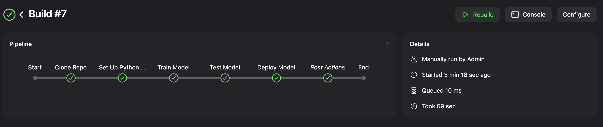
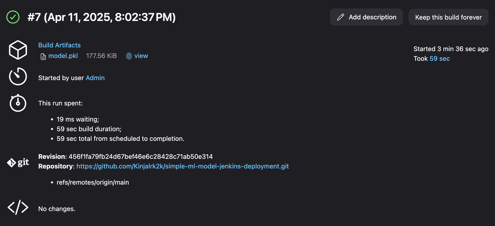

# Experiment 8

## Aim

Deploy ML Model using Jenkins Pipeline: Create a Jenkins pipeline that trains, tests, and deploys a machine learning model.

## Theory

Jenkins is a well-established open-source automation server widely used for continuous integration and delivery (CI/CD). While it's traditionally used in software development workflows, Jenkins is equally powerful in MLOps pipelines, where machine learning models need to be trained, tested, and deployed in an automated and repeatable manner.

- Integrating ML tasks into a Jenkins pipeline ensures that:
- Models are always trained and tested in a clean, repeatable environment.
- Deployment is automated, reducing manual errors.
- Teams can track changes and experiment outcomes via version control and logs.

A Jenkins pipeline is a script (usually written in Groovy) that defines the stages of your process, such as:

- Build: Clone the code, install dependencies
- Train: Run the training script
- Test: Evaluate the model’s performance
- Deploy: Push model to production (or simulate it locally)

## Experiment

### Training

```python
import pandas as pd
from sklearn.ensemble import RandomForestClassifier
import joblib
from sklearn.datasets import load_iris
import os

iris = load_iris()
X, y = iris.data, iris.target
model = RandomForestClassifier(n_estimators=100)
model.fit(X, y)
os.makedirs('model', exist_ok=True)
joblib.dump(model, 'model/model.pkl')
print("✅ Model trained and saved.")
```

### Testing

```python
import joblib
from sklearn.datasets import load_iris
from sklearn.metrics import accuracy_score

model = joblib.load("model/model.pkl")
iris = load_iris()
X, y = iris.data, iris.target
preds = model.predict(X)
print(f"✅ Accuracy: {accuracy_score(y, preds):.2f}")

```

### Pipeline

```Jenkins
pipeline {
    agent any

    environment {
        VENV = 'venv'
        PYTHON = 'python3'
    }

    stages {
        stage('Clone Repo') {
            steps {
                git branch: 'main', url: 'https://github.com/Kinjalrk2k/simple-ml-model-jenkins-deployment.git'
            }
        }

        stage('Set Up Python Env') {
            steps {
                sh '''
                    $PYTHON -m venv $VENV
                    . $VENV/bin/activate
                    pip install --upgrade pip
                    pip install -r requirements.txt
                '''
            }
        }

        stage('Train Model') {
            steps {
                sh '''
                    . $VENV/bin/activate
                    python train.py
                '''
            }
        }

        stage('Test Model') {
            steps {
                sh '''
                    . $VENV/bin/activate
                    python test.py
                '''
            }
        }

        stage('Deploy Model') {
             steps {
                sh '''
                    echo "✅ Model is already saved in model/model.pkl"
                '''
                archiveArtifacts artifacts: 'model/model.pkl', fingerprint: true
            }
        }
    }

    post {
        always {
            echo '🧹 Cleaning up workspace...'
            cleanWs()
        }
    }
}
```

## Outputs



_Pipeline Overview_



_Post build artifacts_

## Conclusion

In this lab, we automated a simple end-to-end ML workflow using Jenkins Pipelines. This included cloning the project, training a model, testing it, and deploying the final artifact—all from a single script.

- By introducing Jenkins to your ML stack, you:
- Eliminate manual and error-prone steps
- Ensure reproducibility and consistency
- Create a foundation for scalable and collaborative model delivery
