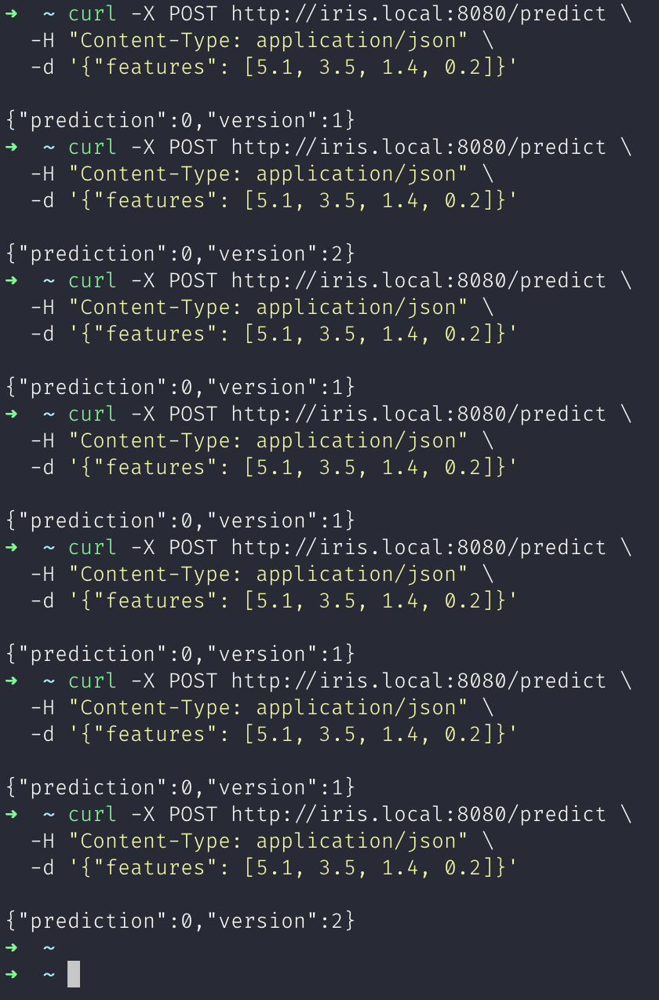

# Experiment 9

## Aim

A/B Testing of ML Models: Deploy two versions of a model and perform A/B testing using load balancers or routing in Kubernetes.

## Theory

A/B testing is a statistical approach used to compare two variants (A and B) of a product or service to determine which performs better. In the context of ML models, A/B testing helps validate whether a newer version of a model (Model B) performs better than the existing one (Model A) in real-world scenarios.

This technique is especially valuable in production environments to:

- Evaluate new models on live traffic without fully replacing the old one.
- Collect real user feedback on performance.
- Make data-driven decisions on promoting models.

In an MLOps pipeline, A/B testing typically involves:

- Deploying two model versions simultaneously.
- Splitting traffic between them using routing rules (e.g., 80/20 or 50/50).
- Monitoring performance metrics and analyzing results.

Kubernetes makes A/B testing easier through:

- Multiple Deployments for different model versions.
- Services for abstracting access to Pods.
- Ingress controllers (like NGINX) or Service Meshes (like Istio) to split traffic intelligently.

## Experiment

### Deployment A

```yaml
apiVersion: apps/v1
kind: Deployment
metadata:
  name: iris-model-a
spec:
  replicas: 1
  selector:
    matchLabels:
      app: iris
      version: a
  template:
    metadata:
      labels:
        app: iris
        version: a
    spec:
      containers:
        - name: iris
          image: model-a:latest
          imagePullPolicy: Never
          ports:
            - containerPort: 9000
```

### Service A

```yaml
apiVersion: v1
kind: Service
metadata:
  name: iris-a-service
spec:
  selector:
    app: iris
    version: a
  ports:
    - port: 80
      targetPort: 9000
```

### Deployment B

```yaml
apiVersion: apps/v1
kind: Deployment
metadata:
  name: iris-model-b
spec:
  replicas: 1
  selector:
    matchLabels:
      app: iris
      version: b
  template:
    metadata:
      labels:
        app: iris
        version: b
    spec:
      containers:
        - name: iris
          image: model-b:latest
          imagePullPolicy: Never
          ports:
            - containerPort: 9000
```

### Service B

```yaml
apiVersion: v1
kind: Service
metadata:
  name: iris-b-service
spec:
  selector:
    app: iris
    version: b
  ports:
    - port: 80
      targetPort: 9000
```

### Main Ingress

```yaml
apiVersion: networking.k8s.io/v1
kind: Ingress
metadata:
  name: iris-ingress
  annotations:
    # nginx.ingress.kubernetes.io/rewrite-target: /
spec:
  rules:
    - host: iris.local
      http:
        paths:
          - path: /predict
            pathType: Prefix
            backend:
              service:
                name: iris-a-service
                port:
                  number: 80
```

### Canary Ingress

```yaml
apiVersion: networking.k8s.io/v1
kind: Ingress
metadata:
  name: iris-canary
  annotations:
    nginx.ingress.kubernetes.io/canary: "true"
    nginx.ingress.kubernetes.io/canary-weight: "50" # split traffic
spec:
  rules:
    - host: iris.local
      http:
        paths:
          - path: /predict
            pathType: Prefix
            backend:
              service:
                name: iris-b-service
                port:
                  number: 80
```

## Outputs



_A/B Testing through API_

## Conclusion

In this lab, we successfully demonstrated how to deploy two versions of an ML model and conduct A/B testing using Kubernetes and traffic splitting. This is a powerful pattern for:

- Validating new models in production
- Reducing risk in rollouts
- Gaining user-driven feedback before fully replacing older versions
