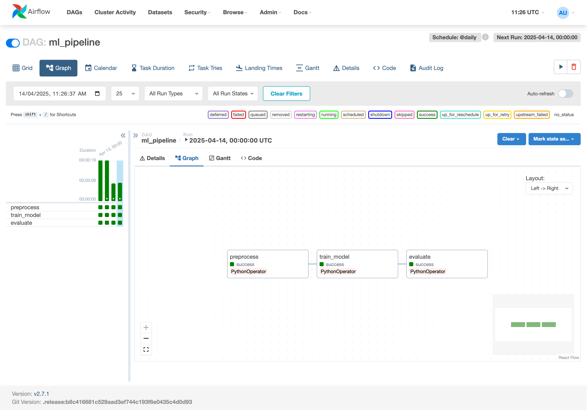
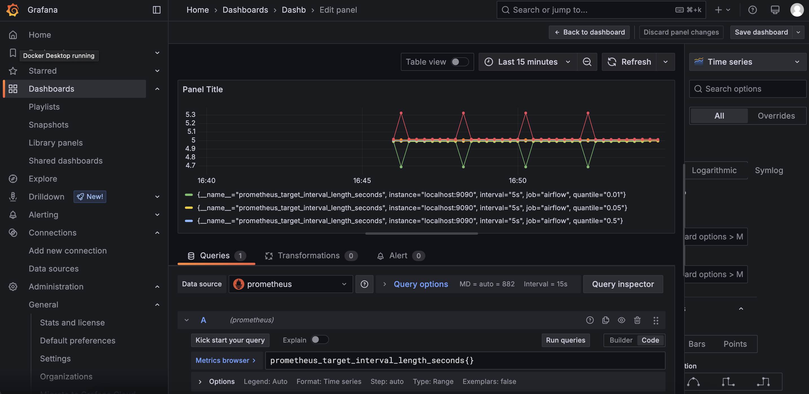
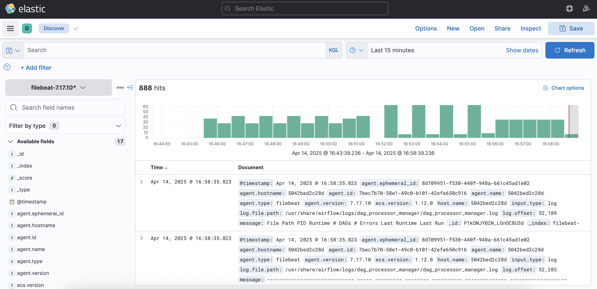

# Experiment 10

## Aim

Observability and Logging in MLOps: Implement monitoring and logging using tools like Prometheus, Grafana, and the ELK stack to track performance, resource utilization, and logs of machine learning pipelines.

## Thoery

In MLOps, deploying a model is just the beginning. Ensuring its reliable operation in production is where the real challenge lies. For that, observability becomes a critical capability — it helps teams understand what’s happening within their ML systems and pipelines at any given time.

Where monitoring tracks known metrics (like CPU, memory, accuracy), observability provides the ability to explore unknowns — such as unexpected behavior or drift in the pipeline — by analyzing logs, metrics, and traces.

- Track resource usage: Helps identify bottlenecks in ETL steps, model training, and serving.
- Detect failures early: Alerts when a DAG step or batch job fails.
- Understand system health: Monitor data ingestion rates, latency, and throughput.
- Improve collaboration: Easier debugging across teams (data engineers, ML engineers, ops).

## Experiment

### Docker setup for the entire stack

```yaml
version: "3.8"

services:
  airflow:
    build: ./airflow
    container_name: airflow
    environment:
      - AIRFLOW__CORE__EXECUTOR=SequentialExecutor
      - AIRFLOW__CORE__LOAD_EXAMPLES=False
      - AIRFLOW__WEBSERVER__RBAC=True
    volumes:
      - ./airflow/dags:/opt/airflow/dags
      - ./airflow/logs:/opt/airflow/logs
    ports:
      - "8080:8080"
      - "8793:8793" # Prometheus exporter
    command: >
      bash -c "airflow db init &&
               airflow users create --username admin --password admin --firstname Admin --lastname User --role Admin --email admin@example.com &&
               airflow webserver & airflow scheduler"

  prometheus:
    image: prom/prometheus:latest
    volumes:
      - ./prometheus/prometheus.yml:/etc/prometheus/prometheus.yml
    ports:
      - "9090:9090"

  grafana:
    image: grafana/grafana:latest
    ports:
      - "3000:3000"
    depends_on:
      - prometheus
    environment:
      - GF_SECURITY_ADMIN_USER=admin
      - GF_SECURITY_ADMIN_PASSWORD=admin

  elasticsearch:
    image: docker.elastic.co/elasticsearch/elasticsearch:7.17.10
    environment:
      - discovery.type=single-node
    ports:
      - "9200:9200"

  kibana:
    image: docker.elastic.co/kibana/kibana:7.17.10
    ports:
      - "5601:5601"
    depends_on:
      - elasticsearch

  filebeat:
    image: docker.elastic.co/beats/filebeat:7.17.10
    volumes:
      - ./filebeat/filebeat.yml:/usr/share/filebeat/filebeat.yml
      - ./airflow/logs:/usr/share/airflow/logs
    depends_on:
      - elasticsearch
      - kibana
```

### Prometheus setup

```yml
global:
  scrape_interval: 5s

scrape_configs:
  - job_name: "airflow"
    static_configs:
      - targets: ["localhost:9090"]
```

### Filebeat setup

```yaml
filebeat.inputs:
  - type: log
    enabled: true
    paths:
      - /usr/share/airflow/logs/**/*.log

output.elasticsearch:
  hosts: ["http://elasticsearch:9200"]

setup.kibana:
  host: "kibana:5601"
```

### Running

```sh
docker-compose up -d
```

## Outputs



_Airflow DAG_



_Grafana dashboard_



_Kibana Dashboard_

## Conclusion

This experiment brings practical observability into MLOps workflows. Rather than treating pipelines as black boxes, tools like Prometheus and ELK open them up to inspection — from performance bottlenecks to silent failures.

- By combining metrics, logging, and visual dashboards, teams can:
- Debug faster
- Prevent issues proactively
- Maintain healthy ML pipelines in production

Observability isn’t just for ops anymore — it's a foundational skill for ML engineers who want to own their models beyond deployment.
