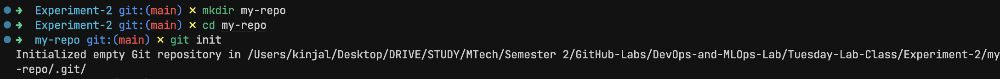
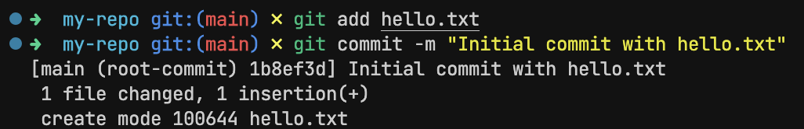
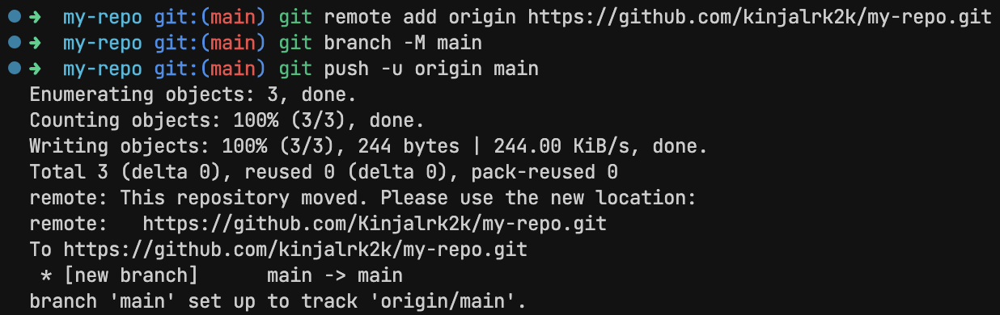
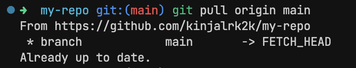

# Experiment 2

## Aim

Setting Up Git: Install Git, create repositories, and practice version control with basic commands (commit, push, pull)

## Theory

Version control is a cornerstone of modern software development. Whether you're working solo or with a team, being able to track changes, collaborate effectively, and roll back when something breaks is crucial. That’s where Git comes in.

Git is a distributed version control system developed by Linus Torvalds (yes, the creator of Linux!) in 2005. Unlike older systems, Git gives every developer a full copy of the repository — history and all — making it incredibly fast, reliable, and flexible.

Git is used for:

- Track every change made to your code
- Work in parallel with teammates without stepping on each other's toes
- Easily roll back to a previous version if something goes wrong
- Integrates with platforms like GitHub, GitLab, and Bitbucket for remote collaboration

## Experiment

### Installing git

_For Windows:_

- Installer can be found in official Git website

_For Linux:_

```sh
sudo apt update
sudo apt install git
```

### Creating a Local Repository

```sh
mkdir my-repo
cd my-repo
git init
```

### Making a commit

```sh
git add hello.txt
git commit -m "Initial commit with hello.txt"
```

### Pushing to GitHub

```sh
git remote add origin https://github.com/kinjalrk2k/my-repo.git
git branch -M main
git push -u origin main
```

### Pulling changes

```sh
git pull origin main
```

## Outputs


_Creating a Local Repository_


_Making a commit_


_Pushing to GitHub_


_Pulling changes_

## Conclusion

In this lab, we successfully set up Git on our local machine, created a repository, and practiced essential version control commands like commit, push, and pull. These may seem like small steps, but they form the foundation of professional software development.
