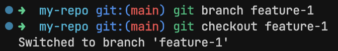
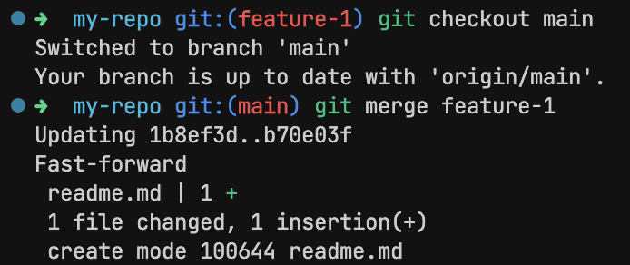
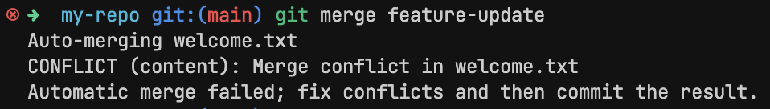
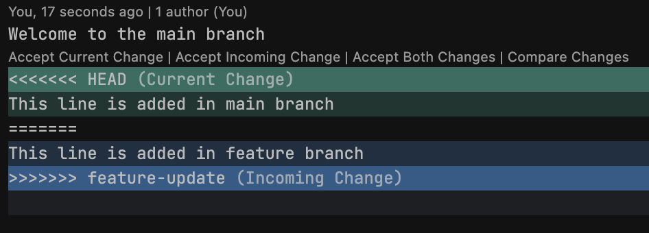
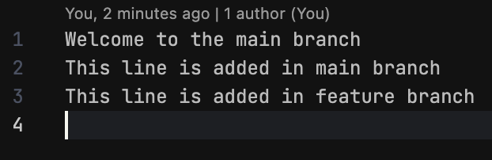
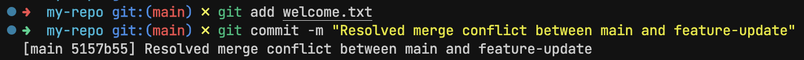

# Experiment 3

## Aim

Branching and Merging in Git: Create and manage multiple branches, merge changes, and resolve conflicts

## Theory

Working with branches in Git is one of the most powerful ways to manage changes in your project — especially when working in teams. Imagine being able to experiment freely without breaking the main codebase. That’s the magic of branching.

A branch in Git is like a parallel universe of your code. You can create a new branch, make changes, test things out, and when you're happy with it, you can merge it back into the main project. All without disrupting the original version.

By default, Git starts you off on the main (or master) branch. But as your project grows, you'll often find yourself creating branches for:

- New features (feature/login-system)
- Bug fixes (fix/button-alignment)
- Experiments (test/new-ui)

Once you've made changes in a branch and want to incorporate them into another branch (usually main), you perform a merge. Git tries to automatically combine the changes. But sometimes, it might need help — that’s when you’ll run into merge conflicts, which you’ll resolve manually.

## Experiment

### Creating new branch

```sh
git branch feature-1
```

### Switch to new branch

```sh
git checkout feature-1
```

### Merge back to main

```sh
git checkout main
git merge feature-1
```

### Merge conflict

```sh
git merge feature-update
```

Merge conflicts are manually fixed in the editor

```sh
git add welcome.txt
git commit -m "Resolved merge conflict between main and feature-update"
```

## Outputs



_Creating and switching branch_



_Merging back to main_



_Merge conflicts_



_Inspecting merge conflicts in editor_



_Fixing merge conflicts in editor_



_Resolved merge conflict_

## Conclusion

In this lab, we explored the core concepts of branching and merging in Git, which are foundational to collaborative and safe software development. We learned how to create branches for isolated development, merge changes back into the main branch, and resolve conflicts when changes overlap.
