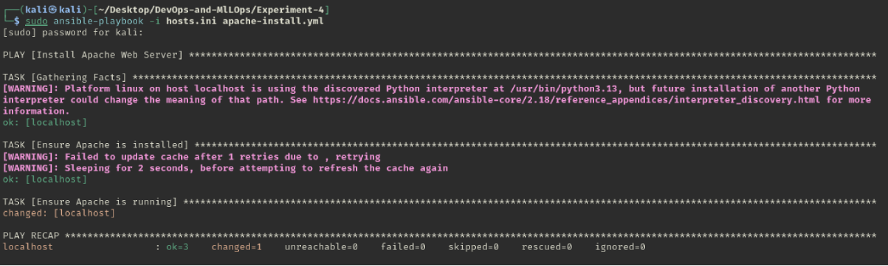
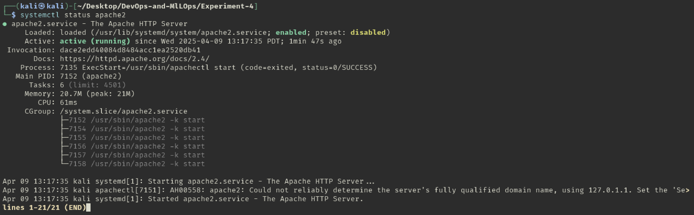

# Experiment 4

## Aim

Infrastructure as Code with Ansible: Write a simple Ansible playbook to install software (e.g., Apache) on a local/virtual machine

## Theory

Managing infrastructure manually can quickly become inefficient and error-prone, especially as systems scale. That’s where Infrastructure as Code (IaC) comes in. With IaC, we define and manage our server infrastructure using machine-readable configuration files rather than manual processes. One of the most popular tools for IaC is Ansible.

Ansible is an open-source automation tool used for configuration management, application deployment, and task automation. It’s agentless, meaning it doesn’t require any special software to be installed on the target systems — just SSH and Python.

Ansible uses YAML-based files called playbooks to describe the desired state of a system. These playbooks are easy to read and write, making Ansible very approachable even for beginners.

_Common Ansible Use Cases:_

- Installing and configuring software
- Managing users and permissions
- Automating routine system tasks
- Deploying applications to multiple servers

In this lab, we’ll use Ansible to install Apache HTTP Server on a local or virtual machine using a simple playbook.

## Experiment

### hosts.ini

```ini
[local]
localhost ansible_connection=local
```

### apache-install.yml

```yaml
---
- name: Install Apache Web Server
  hosts: local
  become: yes

  tasks:
    - name: Ensure Apache is installed
      apt:
        name: apache2
        state: present
        update_cache: yes

    - name: Ensure Apache is running
      service:
        name: apache2
        state: started
        enabled: yes
```

### Running

```sh
ansible-playbook -i hosts.ini apache-install.yml
```

### Verify

```sh
systemctl status apache2
```

## Outputs



_Running Ansible playbook_



_Verifying installation of Apache_

## Conclusion

In this lab, we took a hands-on approach to understanding Infrastructure as Code using Ansible. By writing a simple playbook to install Apache, we saw how system configuration tasks that normally involve multiple steps can be automated and standardized using just a few lines of YAML.
