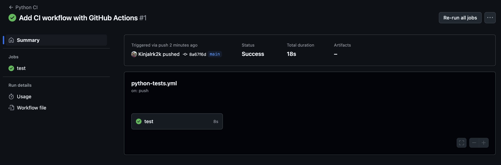

# Experiment 5

## Aim

Continuous Integration with GitHub Actions: Set up a simple CI pipeline that runs tests automatically on push

## Theory

Modern software development isn't just about writing code — it’s also about ensuring that code works consistently, reliably, and automatically. That’s where Continuous Integration (CI) comes into play.

Continuous Integration is a development practice where developers integrate code into a shared repository frequently — sometimes several times a day. Each integration is then verified by an automated build and test process, allowing teams to detect problems early.

CI helps developers catch issues before they reach production, streamlining collaboration and maintaining code quality.

GitHub Actions is a feature built into GitHub that allows you to automate workflows — right from your repository. It lets you set up CI/CD pipelines that can automatically:

- Run tests when you push code
- Build your application
- Deploy to production
- Send alerts or messages
- And much more

GitHub Actions uses simple YAML-based workflows, making it accessible even for beginners. It also integrates tightly with your repository, so everything stays in one place — no external tools needed.

## Experiment

### main.py

```py
def add(a, b):
    return a + b
```

### test_main.py

```py
from main import add

def test_add():
    assert add(2, 3) == 5
```

### Workflow file - .github/workflows/python-tests.yml

```yaml
name: Python CI

on: [push]

jobs:
  test:
    runs-on: ubuntu-latest

    steps:
      - name: Checkout code
        uses: actions/checkout@v3

      - name: Set up Python
        uses: actions/setup-python@v4
        with:
          python-version: "3.10"

      - name: Install dependencies
        run: |
          python -m pip install --upgrade pip
          pip install pytest

      - name: Run tests
        run: |
          pytest
```

## Outputs



_CI tests running on GitHub Actions_

## Conclusion

In this lab, we successfully set up a Continuous Integration pipeline using GitHub Actions, where every code push automatically triggered a test run. We wrote a basic test, defined a CI workflow, and verified it on GitHub — all within a few minutes.
