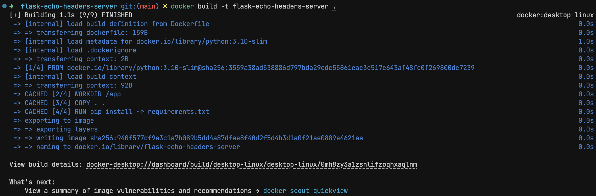
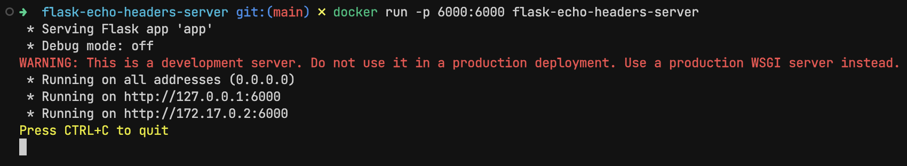
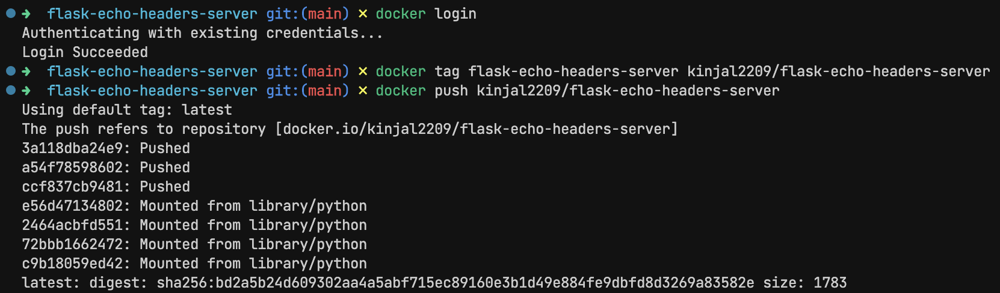

# Experiment 6

## Aim

Containerization with Docker: Build and run a Docker image for a sample application, exploring Dockerfile creation, container management, and pushing images to a registry

## Theory

Imagine you're working on an application that runs perfectly on your machine, but when your teammate tries it — it breaks. Different OS, different dependencies, or even slightly different versions can all lead to frustrating bugs. This is exactly the problem that Docker was designed to solve.

Docker is a platform that enables you to package applications — along with all their dependencies — into standardized containers. These containers can run anywhere: your laptop, a cloud server, or even inside a CI/CD pipeline.

A Docker container is like a lightweight, standalone box that contains everything an application needs to run: code, runtime, system tools, libraries, and settings.

_Reasons to use Containers_

- Consistency across environments — no more "it works on my machine"
- Isolation — containers run separately from each other and the host system
- Portability — you can move containers across environments effortlessly
- Efficiency — they’re faster and lighter than full virtual machines

## Experiment

### Building a sample application

_app.py_

```py
from flask import Flask, request, jsonify
app = Flask(__name__)


@app.route("/", methods=["GET"])
def echo():
    return jsonify({"headers": dict(request.headers)})

if __name__ == '__main__':
    app.run(host='0.0.0.0', port=6000)
```

_requirements.txt_

```txt
flask
```

_Dockerfile_

```Dockerfile
FROM python:3.10-slim

WORKDIR /app

COPY . .

RUN pip install -r requirements.txt

EXPOSE 6000

CMD ["python", "app.py"]
```

### Building Docker Image

```sh
docker build -t flask-echo-headers-server .
```

### Running Docker Container

```sh
docker run -p 6000:6000 flask-echo-headers-server
```

### Pushing to Registry

```sh
docker login
docker tag flask-echo-headers-server kinjal2209/flask-echo-headers-server
docker push kinjal2209/flask-echo-headers-server
```

## Outputs



_Building Docker Image_



_Running Docker Container_



_Pushing to Registry_

## Conclusion

In this lab, we explored containerization using Docker — from writing a Dockerfile to running and pushing an image. We saw how Docker packages applications into isolated containers that can run consistently across different environments.
