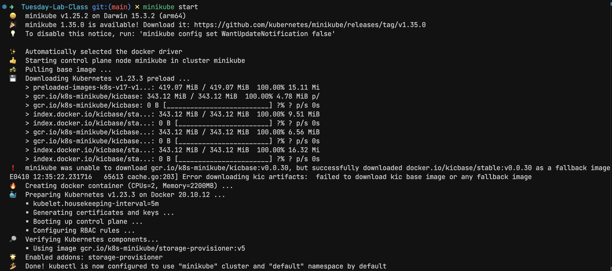
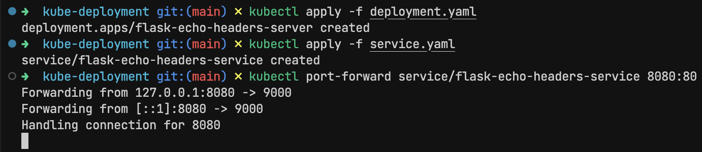
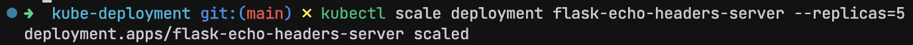
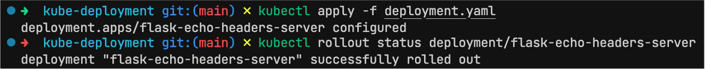
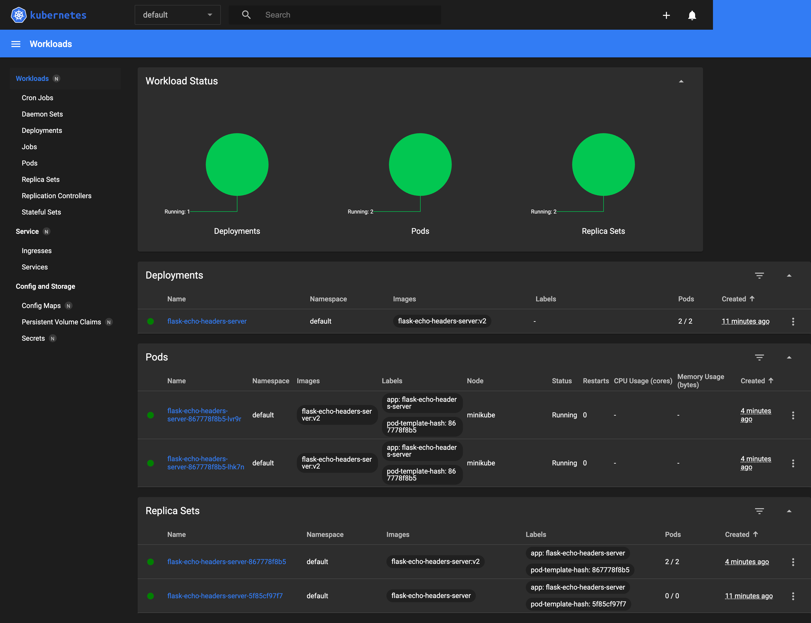

# Experiment 7

## Aim

Orchestration with Kubernetes: Deploy containerized workloads on a Kubernetes cluster, covering Pods, Deployments, Services, and scaling via rolling updates

## Theory

As applications become more complex — with multiple containers, services, and environments — managing them manually can become nearly impossible. That’s where Kubernetes comes in. Often referred to as “K8s,” Kubernetes is the industry-standard platform for orchestrating containerized applications at scale.

Kubernetes is an open-source container orchestration system developed by Google and now maintained by the Cloud Native Computing Foundation (CNCF). Its primary role is to automate deployment, scaling, and management of containerized applications.

It doesn’t just run containers — it handles the entire lifecycle of an application, ensuring availability, stability, and scalability in a production environment.

## Experiment

### Startup Minikube for local Kubernetes cluster

```sh
minikube start
```

### Kubernetes setup

_deplyment.yaml_

```yaml
apiVersion: apps/v1

kind: Deployment

metadata:
  name: flask-echo-headers-server

spec:
  replicas: 2
  selector:
    matchLabels:
      app: flask-echo-headers-server
  template:
    metadata:
      labels:
        app: flask-echo-headers-server
    spec:
      containers:
        - name: web
          image: flask-echo-headers-server
          imagePullPolicy: Never
          ports:
            - containerPort: 9000
```

_service.yaml_

```yaml
apiVersion: v1

kind: Service

metadata:
  name: flask-echo-headers-service

spec:
  selector:
    app: flask-echo-headers-server
  ports:
    - protocol: TCP
      port: 80
      targetPort: 9000
  type: NodePort
```

### Build docker container within minikube

```sh
eval $(minikube docker-env)
docker build -t my-k8s-app .
```

### Deploy service

```sh
kubectl apply -f deployment.yaml
kubectl apply -f service.yaml
kubectl port-forward service/flask-echo-headers-service 8080:80
```

### Scaling

```sh
kubectl scale deployment flask-echo-headers-server --replicas=5
```

### Rolling deployments

```sh
kubectl apply -f deployment.yaml
kubectl rollout status deployment/flask-echo-headers-server
```

## Outputs



_minikube starting_



_Deploying service_



_Scaling_



_Rolling deployments_



_Minikube dashboard_

## Conclusion
