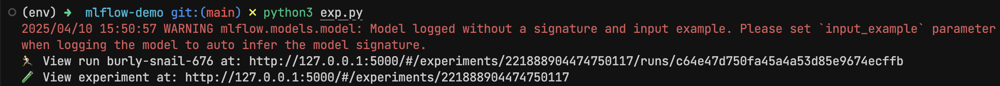
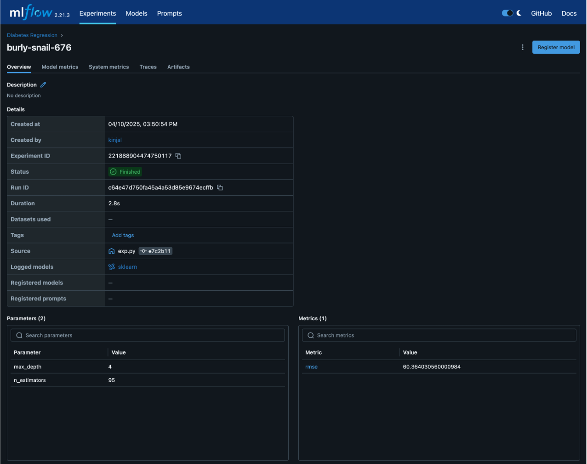
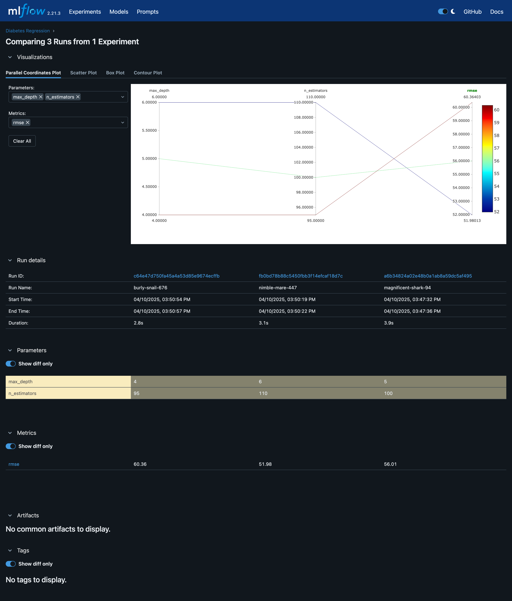

# Experiment 8

## Aim

ML Experiment Tracking with MLflow: Log experiments, hyperparameters, metrics, and artifacts using MLflow to enable reproducibility and model comparison

## Theory

In machine learning, especially in real-world projects, we rarely build just one model. We often try out different algorithms, tweak hyperparameters, and change training data to improve performance. Over time, this leads to multiple versions of models — and without a structured way to keep track, it's nearly impossible to reproduce results or understand which version worked best.

That’s where MLflow becomes essential.

MLflow is an open-source platform that helps manage the end-to-end machine learning lifecycle. One of its core modules, MLflow Tracking, is specifically built for logging and organizing machine learning experiments. With MLflow, you can log key aspects like:

- Hyperparameters used in training (e.g., learning rate, batch size)
- Metrics like accuracy, RMSE, or loss
- Artifacts such as trained models or output plots
- Code versions and environments

This creates a reliable history of experiments, making it easy to reproduce past results and compare models side by side.

## Experiment

### Setup MLflow

```sh
pip install mlflow
mlflow ui
```

### ML experiment

```py
import mlflow
import mlflow.sklearn
from sklearn.ensemble import RandomForestRegressor
from sklearn.metrics import mean_squared_error
from sklearn.datasets import load_diabetes
from sklearn.model_selection import train_test_split

# Load dataset
X, y = load_diabetes(return_X_y=True)
X_train, X_test, y_train, y_test = train_test_split(X, y, test_size=0.2)

# Set experiment
mlflow.set_experiment("Diabetes Regression")

# Start a new MLflow run
with mlflow.start_run():
    # Set hyperparameters
    n_estimators = 150
    max_depth = 6

    # Train model
    model = RandomForestRegressor(n_estimators=n_estimators, max_depth=max_depth)
    model.fit(X_train, y_train)

    # Predict and evaluate
    preds = model.predict(X_test)
    rmse = mean_squared_error(y_test, preds, squared=False)

    # Log everything
    mlflow.log_param("n_estimators", n_estimators)
    mlflow.log_param("max_depth", max_depth)
    mlflow.log_metric("rmse", rmse)
    mlflow.sklearn.log_model(model, "model")
```

## Outputs



_Running ML experiment_



_Logging hyperparameters, metrics and artifacts_



_Model comparison_

## Conclusion

In this lab, we learned how to use MLflow to bring structure, traceability, and transparency into the machine learning workflow. By logging experiments with hyperparameters, evaluation metrics, and trained models, MLflow makes it incredibly easy to:

- Reproduce previous model results with confidence
- Compare different model runs quickly and visually
- Collaborate with teammates on model development
- Scale from local experiments to team-wide MLOps pipelines
