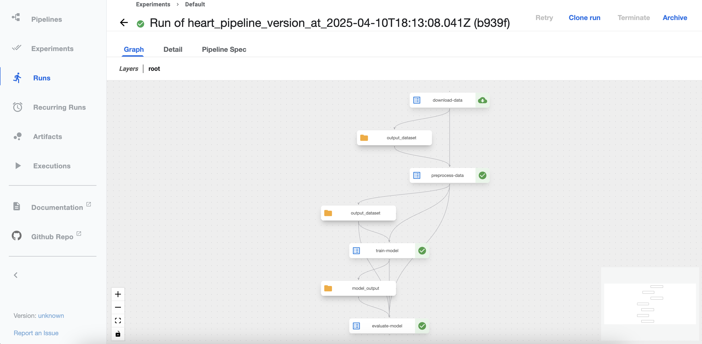

# Experiment 9

## Aim

Model Deployment with Kubeflow: Automate end-to-end ML workflows (training, validation, serving) within a Kubernetes environment using Kubeflow Pipelines

## Theory

Machine learning models go through many stages — from data preprocessing and model training to validation and finally deployment. Managing all these steps manually becomes increasingly complex and error-prone, especially when teams are working on multiple models or deploying frequently. That’s where Kubeflow Pipelines come into play.

Kubeflow is an open-source MLOps platform built on Kubernetes. It provides a set of tools that make it easier to develop, orchestrate, deploy, and manage ML workflows in a scalable and reproducible way — all while leveraging Kubernetes' strengths like scalability and container orchestration.

Kubeflow Pipelines is a core component of Kubeflow that helps automate ML workflows as a series of steps. Each step can be a containerized operation — like loading data, training a model, validating it, or deploying it. These steps are defined as DAGs (Directed Acyclic Graphs) and run seamlessly in Kubernetes.

## Experiment

### Pipeline

```sh
import kfp
from kfp import dsl
from kfp.dsl import component, Input, Output, Dataset, Model

@component(
    packages_to_install=["pandas"]
)
def download_data(output_dataset: Output[Dataset]):
    import os
    import pandas as pd
    url = "https://raw.githubusercontent.com/sharmaroshan/Heart-UCI-Dataset/refs/heads/master/heart.csv"
    df = pd.read_csv(url)

    os.makedirs(output_dataset.path, exist_ok=True)
    df.to_csv(os.path.join(output_dataset.path, "heart.csv"), index=False)

@component(
    packages_to_install=["pandas", "scikit-learn"]
)
def preprocess_data(input_dataset: Input[Dataset], output_dataset: Output[Dataset]):
    import pandas as pd
    from sklearn.model_selection import train_test_split
    import os

    df = pd.read_csv(input_dataset.path + "/heart.csv")
    X = df.drop("target", axis=1)
    y = df["target"]
    X_train, X_test, y_train, y_test = train_test_split(X, y, test_size=0.2, random_state=42)

    train_df = X_train.copy()
    train_df["target"] = y_train
    test_df = X_test.copy()
    test_df["target"] = y_test

    os.makedirs(output_dataset.path, exist_ok=True)

    train_df.to_csv(output_dataset.path + "/train.csv", index=False)
    test_df.to_csv(output_dataset.path + "/test.csv", index=False)

@component(
    packages_to_install=["pandas", "scikit-learn", "joblib"]
)
def train_model(preprocessed_dataset: Input[Dataset], model_output: Output[Model]):
    import pandas as pd
    from sklearn.linear_model import LogisticRegression
    import joblib
    import os

    df = pd.read_csv(preprocessed_dataset.path + "/train.csv")
    X_train = df.drop("target", axis=1)
    y_train = df["target"]

    model = LogisticRegression(max_iter=1000)
    model.fit(X_train, y_train)

    os.makedirs(model_output.path, exist_ok=True)

    joblib.dump(model, model_output.path + "/model.joblib")

@component(
    packages_to_install=["pandas", "scikit-learn", "joblib"]
)
def evaluate_model(preprocessed_dataset: Input[Dataset], model_input: Input[Model]):
    import pandas as pd
    import joblib
    from sklearn.metrics import classification_report

    df = pd.read_csv(preprocessed_dataset.path + "/test.csv")
    X_test = df.drop("target", axis=1)
    y_test = df["target"]

    model = joblib.load(model_input.path + "/model.joblib")
    y_pred = model.predict(X_test)

    report = classification_report(y_test, y_pred)
    print("Classification Report:\n", report)

@dsl.pipeline(
    name="heart-disease-pipeline",
    description="Heart Disease Prediction Pipeline"
)
def heart_disease_pipeline():
    raw_data = download_data()

    preprocessed = preprocess_data(
        input_dataset=raw_data.outputs["output_dataset"]
    )

    trained_model = train_model(
        preprocessed_dataset=preprocessed.outputs["output_dataset"]
    )

    evaluate_model(
        preprocessed_dataset=preprocessed.outputs["output_dataset"],
        model_input=trained_model.outputs["model_output"]
    )

from kfp.v2 import compiler

compiler.Compiler().compile(
    pipeline_func=heart_disease_pipeline,
    package_path="heart_pipeline.yaml",
)
```

## Output



_Running Experiment on Kubeflow_

## Conclusion

In this lab, we successfully built and ran a simple ML pipeline using Kubeflow Pipelines on Kubernetes. By breaking the ML workflow into discrete, containerized steps, Kubeflow enabled:

- Automation of repetitive and error-prone tasks
- Reproducibility of results across environments and team members
- Scalability using Kubernetes’ native orchestration
- Model comparison and tracking through UI and logs

This approach not only simplifies deployment but also ensures that models are built and delivered in a production-ready, version-controlled, and collaborative manner — making it ideal for modern MLOps workflows.
